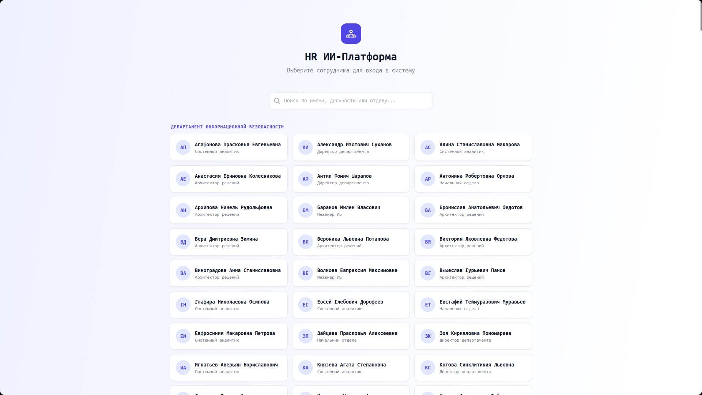
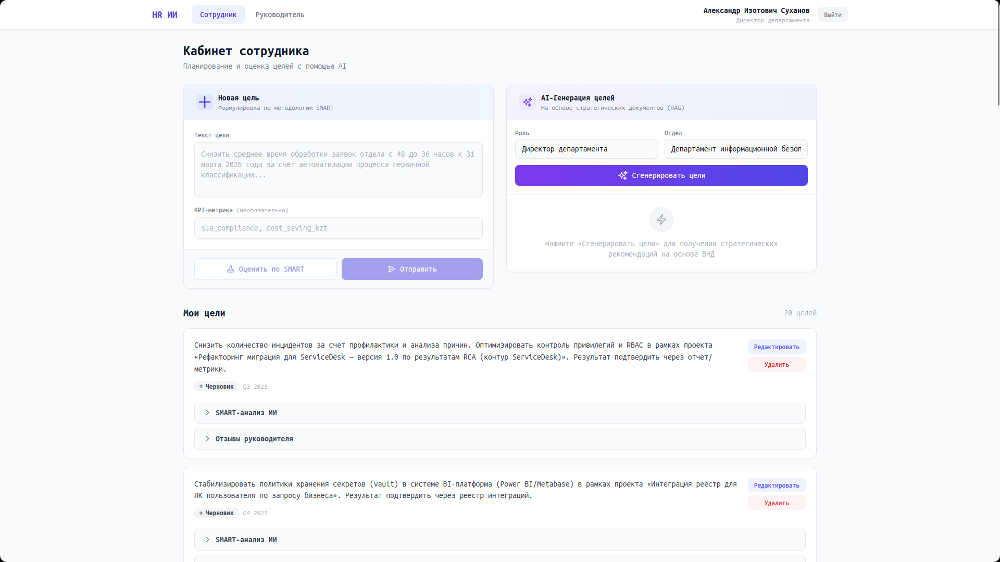
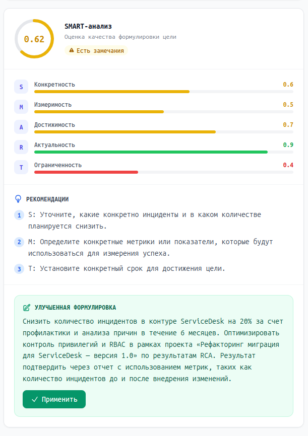
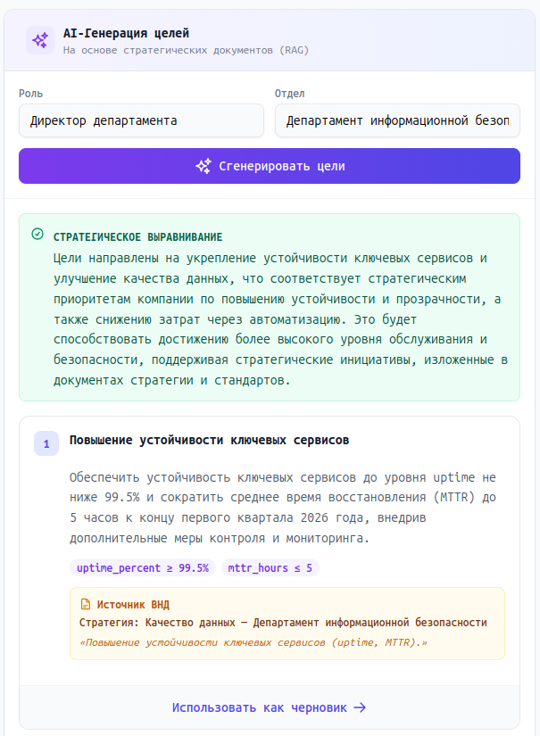
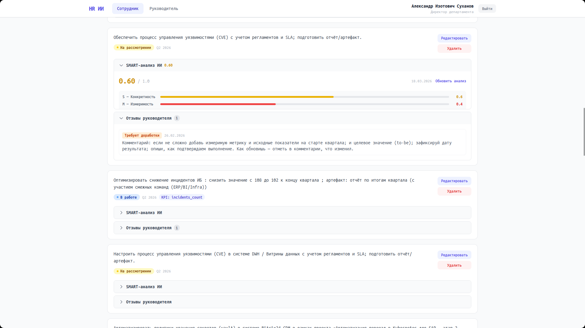
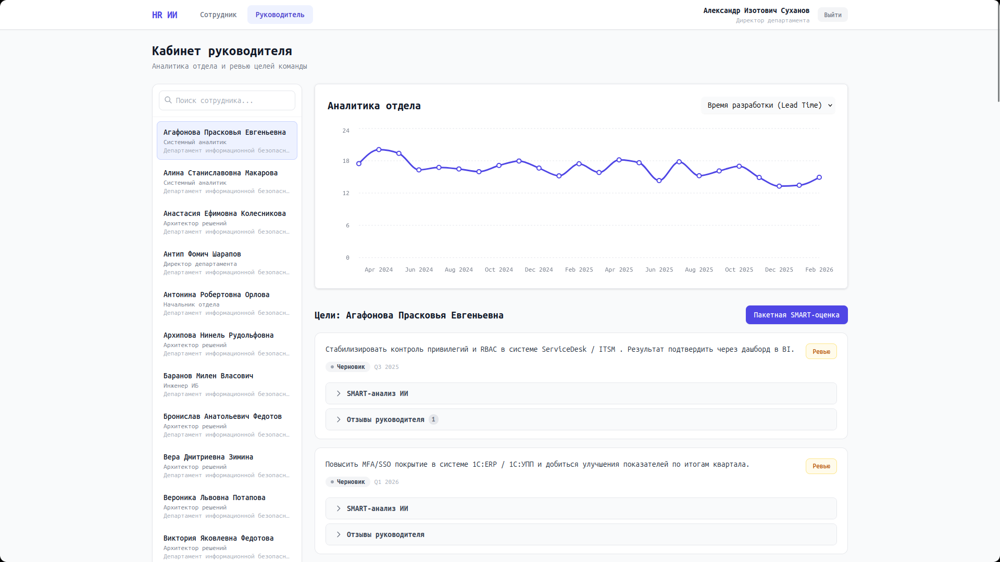
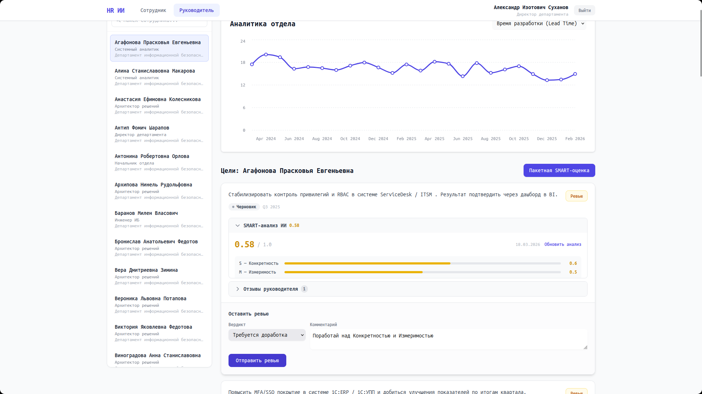
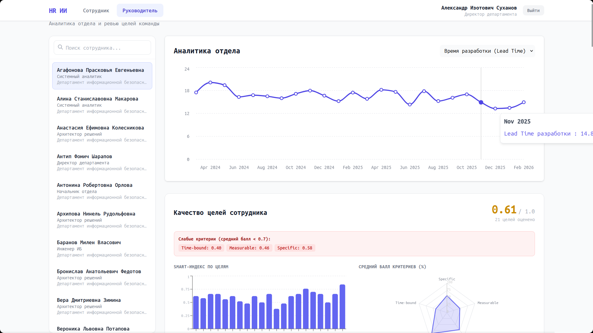

# HR ИИ — Система управления целями с искусственным интеллектом

Веб-приложение для постановки и оценки целей сотрудников по методологии SMART с помощью ИИ. Руководители просматривают цели команды, оставляют рецензии, а дашборд KPI показывает аналитику отдела в реальном времени.

> Hackathon MVP — разработано на стеке FastAPI + React + OpenAI + PostgreSQL + ChromaDB (RAG).

---

## Содержание

1. [Установка](#-быстрый-старт)
2. [Архитектура проекта](#-архитектура-проекта)
3. [Функциональность](#-функциональность)
4. [API-эндпоинты](#-api-эндпоинты)
5. [Технологический стек](#-технологический-стек)
6. [Структура проекта](#-структура-проекта)
7. [Скриншоты](#-скриншоты)

---

## Установка

### Требования

- Docker и Docker Compose
- Ключ OpenAI API

### 1. Клонировать репозиторий

```bash
git clone <url-репозитория>
cd hr_ai_system
```

### 2. Настроить переменные окружения


Создайте файл `.env` в корне проекта:

```env
OPENAI_API_KEY=sk-proj-...
```

### 3. Запустить все сервисы

```bash
docker compose up --build
```

Будут подняты 5 контейнеров:

| Сервис     | Порт  | Описание                          |
|------------|-------|-----------------------------------|
| frontend   | 5173  | React-приложение (Vite)           |
| backend    | 8000  | FastAPI сервер                    |
| db         | 5432  | PostgreSQL 17                     |
| chroma     | 8001  | ChromaDB (векторная БД для RAG)   |
| pgadmin    | 5050  | Веб-интерфейс для PostgreSQL      |

### 4. Открыть приложение

Перейдите в браузере по адресу:

```
http://localhost:5173
```

---

## Архитектура проекта

```
Frontend (React + Vite, :5173)
        │
        │ HTTP / REST API
        ▼
Backend (FastAPI, :8000)
        │
        ├── PostgreSQL 17 (:5432) via asyncpg
        │
        ├── OpenAI API for LLM features
        │
        └── ChromaDB (:8001) for RAG (vector storage & retrieval)
```

**Поток данных:**

1. Сотрудник создаёт цель через форму → сохраняется в PostgreSQL
2. При нажатии «Оценить по SMART» → бэкенд отправляет текст в OpenAI → возвращает оценки S/M/A/R/T
3. При генерации целей (RAG) → бэкенд ищет релевантные документы в ChromaDB → формирует контекст → OpenAI генерирует цели на основе стратегии компании
4. Руководитель просматривает цели команды → оставляет вердикт (одобрить / доработать / отклонить)

---

## Функциональность

### Вход в систему

- При открытии приложения пользователь выбирает свой профиль из списка сотрудников
- Без пароля (упрощённый режим для MVP/демо)
- После выбора доступны два режима: **Сотрудник** и **Руководитель**

### Кабинет сотрудника

- **Создание целей** — форма с текстом цели и необязательной KPI-метрикой
- **SMART-анализ ИИ** — оценка формулировки цели по 5 критериям (Specific, Measurable, Achievable, Relevant, Time-bound) с визуальным отображением баллов, рекомендациями и улучшенной формулировкой
- **AI-генерация целей (RAG)** — ИИ предлагает стратегические цели на основе внутренних нормативных документов компании, с указанием источника и цитаты
- **Управление целями** — редактирование, удаление, просмотр статуса и истории рецензий от руководителя
- **Сохранение AI-анализа** — результаты SMART-оценки сохраняются в БД и доступны для повторного просмотра

### Кабинет руководителя

- **Боковая панель сотрудников** — выбор подчинённого из списка с поиском, отображением должности и количества целей на проверку
- **Рецензирование целей** — три вердикта: «Одобрить», «На доработку», «Отклонить» с обязательным комментарием
- **Пакетная сводка** — краткий AI-анализ всех целей выбранного сотрудника
- **KPI-дашборд** — графики метрик отдела на основе временных рядов из БД

### RAG-пайплайн

- Внутренние документы компании (ВНД, политики, стратегии) загружаются в ChromaDB при старте сервера
- Документы разбиваются на чанки через LangChain text splitters и векторизуются
- При генерации целей система находит релевантные фрагменты и передаёт их в промпт OpenAI

---

## API-эндпоинты

### Цели

| Метод  | Путь                                    | Описание                              |
|--------|-----------------------------------------|---------------------------------------|
| GET    | `/api/v1/goals?employee_id=...`         | Получить цели сотрудника              |
| POST   | `/api/v1/goals`                         | Создать новую цель                    |
| PUT    | `/api/v1/goals/{goal_id}`               | Обновить цель                         |
| DELETE | `/api/v1/goals/{goal_id}`               | Удалить цель                          |
| PATCH  | `/api/v1/goals/{goal_id}/status`        | Изменить статус цели                  |

### AI / Оценка

| Метод | Путь                                     | Описание                              |
|-------|------------------------------------------|---------------------------------------|
| POST  | `/api/v1/goals/evaluate`                 | SMART-анализ текста цели              |
| POST  | `/api/v1/goals/generate`                 | AI-генерация целей (RAG)              |
| POST  | `/api/v1/goals/{goal_id}/evaluations`    | Запустить и сохранить SMART-анализ    |
| GET   | `/api/v1/goals/{goal_id}/evaluations/latest` | Последний сохранённый анализ      |

### Рецензии

| Метод | Путь                                     | Описание                              |
|-------|------------------------------------------|---------------------------------------|
| POST  | `/api/v1/goals/{goal_id}/reviews`        | Создать рецензию руководителя         |
| GET   | `/api/v1/goals/{goal_id}/reviews`        | История рецензий по цели              |

### Сотрудники и аналитика

| Метод | Путь                                     | Описание                              |
|-------|------------------------------------------|---------------------------------------|
| GET   | `/api/v1/employees`                      | Список сотрудников (фильтр по manager_id) |
| GET   | `/api/v1/departments`                    | Список отделов                        |
| GET   | `/api/v1/analytics/kpi/{department_id}`  | KPI-данные отдела для графиков        |

---

## Технологический стек

### Backend

| Технология                | Назначение                                      |
|---------------------------|-------------------------------------------------|
| Python 3.12+              | Язык бэкенда                                    |
| FastAPI                   | Веб-фреймворк                                   |
| SQLAlchemy + asyncpg      | ORM с асинхронным драйвером PostgreSQL           |
| Pydantic                  | Валидация данных и парсинг ответов LLM           |
| OpenAI API       | SMART-оценка и генерация целей                   |
| ChromaDB                  | Векторная БД для RAG-пайплайна                   |
| LangChain text splitters  | Разбиение документов на чанки                    |

### Frontend

| Технология     | Назначение                          |
|----------------|-------------------------------------|
| React 18       | UI-фреймворк                        |
| Vite           | Сборщик                             |
| TailwindCSS    | Стилизация                          |
| Recharts       | Графики KPI-дашборда                |

### Инфраструктура

| Технология         | Назначение                            |
|--------------------|---------------------------------------|
| Docker Compose     | Оркестрация всех сервисов             |
| PostgreSQL 17      | Основная реляционная БД               |
| ChromaDB           | Векторное хранилище документов        |
| pgAdmin 4          | Веб-UI для работы с PostgreSQL        |

---

## Структура проекта

```
hr_ai_system/
├── backend/
│   ├── Dockerfile
│   ├── pyproject.toml
│   ├── prompts.yaml                 # Все промпты для OpenAI
│   └── src/
│       ├── main.py                  # Точка входа, lifespan (RAG ingestion)
│       ├── core/
│       │   └── database.py          # Подключение к БД, get_db
│       ├── models/
│       │   ├── schema.py            # SQLAlchemy ORM-модели
│       │   └── llm_schemas.py       # Pydantic-схемы для ответов LLM
│       ├── routers/
│       │   ├── goals.py             # CRUD целей, оценка, рецензии
│       │   ├── employees.py         # Сотрудники и отделы
│       │   └── analytics.py         # KPI-дашборд
│       ├── schemas/
│       │   └── api.py               # Pydantic-схемы запросов/ответов API
│       └── services/
│           ├── smart_evaluator.py   # SMART-анализ через OpenAI
│           ├── goal_generator.py    # Генерация целей (RAG + OpenAI)
│           └── rag_service.py       # Работа с ChromaDB, ingestion
├── frontend/
│   ├── Dockerfile
│   └── src/
│       ├── App.jsx                  # Корневой компонент, навигация
│       ├── api.js                   # HTTP-клиент к бэкенду
│       ├── UserContext.jsx          # Контекст авторизации
│       ├── views/
│       │   ├── EmployeeView.jsx     # Кабинет сотрудника
│       │   └── ManagerView.jsx      # Кабинет руководителя
│       └── components/
│           ├── UserPicker.jsx       # Экран выбора пользователя
│           ├── GoalCard.jsx         # Карточка цели (общий компонент)
│           ├── GoalSuggestions.jsx   # AI-генерация целей (RAG)
│           ├── SmartScoreCard.jsx   # Визуализация SMART-анализа
│           ├── Dashboard.jsx        # KPI-графики
│           └── shared.jsx           # Переиспользуемые UI-компоненты
├── 01_schema.sql                    # Схема БД (создание таблиц)
├── 02_data.sql                      # Начальные данные (сотрудники, KPI, документы)
├── docker-compose.yml
├── .env                             # OPENAI_API_KEY
└── README.md
```

---

## Скриншоты

### Экран выбора пользователя



---

### Кабинет сотрудника — форма создания цели



---

### SMART-анализ цели



---

### AI-генерация целей (RAG)



---

### Список целей сотрудника



---

### Кабинет руководителя — выбор сотрудника



---

### Рецензирование цели руководителем



---

### KPI-дашборд



---

## Авторы

- Shoplikov Alisher
